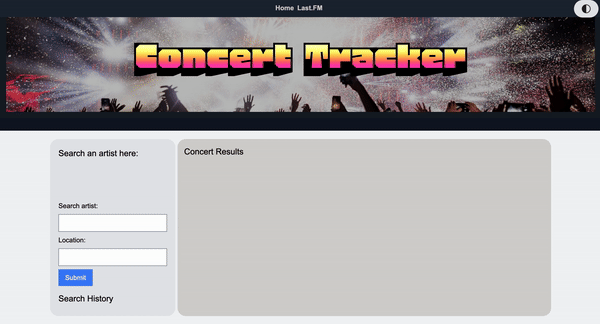

# Concert-Tracker
A tool for finding concerts near you from your favorite artists

## Description
This website allows you to search your favorite artist and was built for the convenience of music and concert lovers alike.
The user will have the ability to access the largest online music service, Last.fm.
This website was built to streamline upcoming events without having to dig through unwanted content. 
We learned to collaborate with one another and use effective communication to accomplish our goals.

## Usage

- Toggle dark and light modes to ease your eyes.
- On the Main Page search your favorite artists' (or by location) to get upcoming events and concerts.
- On the Lastfm Page, do a search with your lastfm username, and look for your top artists and get immediate results. 

https://github.com/akaufmanfrey/Concert-Tracker

## Credits

API's used:
- PredictHQ: https://www.predicthq.com
- Last.FM: https://www.last.fm

CSS Frameworks and other:
- Tailwind: https://tailwindcss.com
- Flowbite: 
- Custom Fonts: https://fonts.gstatic.com
- Custom fonts: https://fonts.google.com
- Custom icons: https://boxicons.com
- Color codes: https://html-color-codes.infost
- Jquery: https://code.jquery.com/jquery-3.4.1.min.js

Collaborators:
- Adam Kaufman: https://github.com/akaufmanfrey
- Hamid: https://github.com/hmd-asg
- Corey: https://github.com/Chamberbankes
- Mark Norberte: https://github.com/markjas0n

## License

Please refer to the license in the repo.

## Features

- Dark Mode Toggle:
The page includes a dark mode feature that users can toggle on and off using a button. The state is saved in localStorage, so the preference persists across sessions.

Fixed Navigation Bar:
- A fixed navigation bar at the top of the page ensures easy access to different sections of the site. The navigation links change color on hover.

Responsive Design:
- The layout is responsive, with a flexible container and columns that adjust based on screen size. The navigation bar and content sections use Flexbox for alignment and distribution.

Artist Search Feature:
- Users can search for artists and concerts. The search form includes inputs for artist name and location, with results fetched dynamically using the OpenWeather API for geolocation and the PredictHQ API for events.

Search History:
- The search history is stored in localStorage and displayed as buttons in the sidebar. Users can click on these buttons to quickly perform previous searches again.

Concert Results:
- The concert results are displayed dynamically, with a "Load More" button that fetches additional results if available. The results are presented as cards with details like the concert title, date, and location.

Header Image Overlay:
- The header includes a background image with a dark overlay and a centered title, creating a visually appealing introduction.

Last.FM Integration:
- The separate lastfm.html page allows users to search for their top artists using the Last.FM API. The results display as clickable links that lead to a detailed view of each artist's concerts.

Custom Font:
- The page uses a custom font ("Honk") for the logo and footer, giving it a unique and consistent branding.

Styled Components:
- Various components, such as buttons, forms, and cards, are styled with Tailwind CSS classes and custom CSS to ensure a cohesive and modern look.

Smooth Transitions:
- Elements like buttons have smooth hover effects and transitions, enhancing the user experience by providing visual feedback.

Error Handling:
- The JavaScript code includes error handling for API requests, displaying alerts when there are issues fetching data, ensuring the user is informed if something goes wrong.
These features collectively create a rich, interactive, and user-friendly experience for visitors to the webpage.

